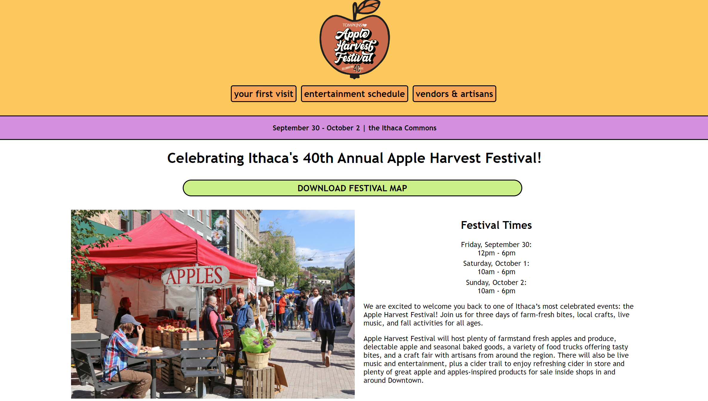
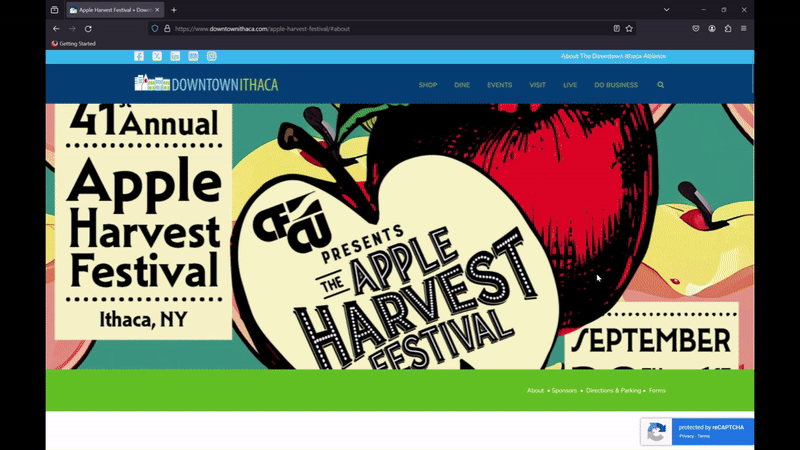

# [Ithaca Apple Festival Redesign](https://gitstelle.github.io/info1300-applefest-website)

This was a project for INFO 1300: Introductory Design and Programming for the Web in spring 2023. We were tasked to redesign the website for the 2022 Ithaca Apple Harvest Festival (Applefest), which currently exists as a single web page from the Downtown Ithaca website.

The website submitted for this project can be found [here.](https://gitstelle.github.io/info1300-applefest-website)

The [current website](https://www.downtownithaca.com/apple-harvest-festival/#about
) (the website to be redesigned), in 2023:

